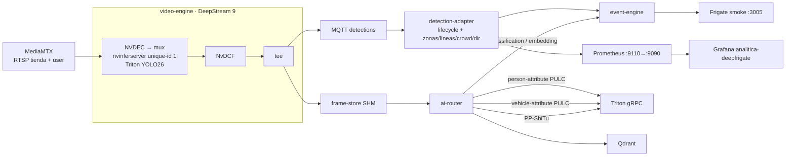

# Arquitectura DeepFrigate

Camino que **corre** en el lab (4 sep 2026). Tesla T4. Cámaras en el
`pipeline.yaml` vivo: `tienda` y `user` (mux DS 1280×720; live Frigate
`tienda` 1920×1080 @ 10). `trafico` está en MediaMTX / YAML de fuentes,
no en el pipeline. Cómo se enganchó `user`: `docs/CAMARA-USER.md`.
Frigate smoke no decodifica (HANDOFF 4 sep).

`/home/agent/arquitectura.md` es **Savant**. No editarlo. Este fichero es
el de DeepFrigate.

Vídeo y metadatos viajan por caminos distintos. DeepStream no pinta zonas
ni atributos sobre el fotograma.

Detalle de analíticas (zonas, Grafana, deuda): `docs/ANALITICAS-FUENTES.md`.
Lab / recreate: `HANDOFF.md`.

---

## 1. Camino completo



Dos ramas después del tracker:

| Rama | Qué lleva | Quién consume |
|---|---|---|
| MQTT `deepfrigate/detections` | bbox, track, label, score | adapter → event-engine → Frigate / Grafana |
| SHM FrameRef (crops RGB) | píxeles del objeto | ai-router → Triton (PULC, ShiTu) |

---

## 2. Qué hay en el grafo GStreamer

Un solo `nvinferserver`. **No hay SGIE.**

```text
nvurisrcbin → nvstreammux → nvinferserver (unique-id 1, YOLO26)
           → nvtracker (NvDCF) → tee
                |-> nvmsgconv → nvmsgbroker (MQTT)
                `-> queue leaky → nvvideoconvert → crops → frame-store
```

Código: `services/video-engine/app/main.py`. Declaración:
`services/video-engine/config/pipeline.yaml`.

`pipeline.yaml` lista `enrichments` (`vehicle-embedding`,
`person-attribute`, `vehicle-attribute`). Eso **no** añade un segundo
`nvinfer` al grafo.
Son modelos que Triton debe tener cargados y que **ai-router** llama
por gRPC sobre el crop. En Savant, PULC sí iba de SGIE
(`nvinfer` con `input.object: person`). Aquí no.

---

## 3. Atributos de persona (no es secondary GIE)

Salen del **ai-router**, no de DeepStream.

1. El exporter del video-engine recorta `person` (best-frame / refresh)
   y registra un FrameRef en SHM.
2. El adapter emite `START`/`UPDATE` en
   `deepfrigate/tracked-objects/{camera}`.
3. ai-router lee el crop (`GET /v1/tracks/.../frame-refs`).
4. **PULC** `person-attribute` en Triton (TensorRT FP16, `x [N,3,256,192]`
   → 26 scores). Género, edad, orientación, manga, prenda inferior,
   gafas, sombrero, objeto en mano, bolsa. Tope:
   `ATTRIBUTE_MAX_PER_TRACK` (default 2 inferencias por track).
5. **PULC** `vehicle-attribute` (TensorRT FP16, `x [N,3,192,256]` → 19
   scores) para `label=car`: color (10) + tipo de carrocería (9).
   Misma cola FrameRef, **sin** HSV. Se guarda en
   `event.data.vehicle_attributes`. No es marca/modelo.
6. **Color de ropa** no es un modelo: HSV en
   `services/ai-router/app/clothing_color.py` (voto por ventanas).
   Solo persona.
7. Publica `update_type: classification` por MQTT. Event-engine lo
   guarda en `person_attributes` o `vehicle_attributes` según `label`.

Origen: PaddleClas PULC `person_attribute` (PA-100K) y
`vehicle_attribute` (VeRi), convertidos a ONNX/TRT. Runtime: solo
Triton. Código: `services/ai-router/app/attribute.py`,
`services/ai-router/app/vehicle_attribute.py`,
`models/person-attribute/README.md`,
`models/vehicle-attribute/README.md`.

Embeddings (PP-ShiTu) son el mismo patrón: crop SHM → Triton → Qdrant,
`update_type: embedding` / `visual_match`. Tampoco son SGIE.

---

## 4. Analíticas (dónde / cuándo)

El pie (centro de la base del bbox) es el ancla. Geometría propia
(`geometry.py`, ray-cast, cruce de segmento). Sin Supervision.

| Motor | Qué |
|---|---|
| `ZoneEngine` | inercia Frigate, enter/exit, dwell en polígono, merodeo 15 s |
| `LineEngine` | un `line_in`/`line_out` por track |
| `DirectionEngine` | ángulo vs vector, una vez por track |
| `crowd.py` | overcrowding con histéresis |
| `metrics.py` | `/metrics` `:9110` (`sv_*` + `df_*`) |

---

## 5. Frameworks (los que corren)

| Pieza | Versión / dónde | Rol |
|---|---|---|
| DeepStream | 9.0 (`DEEPSTREAM_IMAGE`) | decode, mux, PGIE, tracker, MQTT, export |
| TensorRT / Triton | 26.01 | YOLO26, PULC, ShiTu. Los `.plan` |
| NvDCF | `config_tracker_NvDCF_perf.yml` | IDs |
| Python adapter | zonas / líneas / crowd / dir | “cuándo” |
| ai-router | gRPC Triton + HSV | atributos y embeddings |
| Frigate 0.16-fork PG | smoke `:3005` | NVR copy-only (go2rtc, sin decode); Explore / timeline / thumbs. Jina v2 `large` en GPU (5 sep) |
| Prometheus / Grafana | `:9090` / `:3001` | `analitica-deepfrigate` |

**No están en el runtime:** Savant, Supervision, `gst-nvdsanalytics`,
ByteTrack, Roboflow Workflows, segundo `nvinfer`.

---

## 5b. Embeddings (dos sistemas, misma miniatura)

```text
video-engine: mejor frame → {track}-thumb.webp (175 px) + manifest.json (bbox)
   ├─ event-engine copia → clips/thumbs/{cam}/{event_id}.webp
   │      └─ Frigate al END: Jina v2 (onnxruntime CUDA en el contenedor) → vec_thumbnails
   └─ ai-router al END: lee ds-snapshots → Triton PP-ShiTu → Qdrant vehicle_embeddings
```

Jina alimenta el buscador de texto de Explore; PP-ShiTu el aside de
similitud visual (`platform-api /v1/frigate-events/{id}/similar`). Frigate
no habla Triton: usa su propio onnxruntime con `CUDAExecutionProvider`.
Ver `docs/OPERACION.md` §6.

## 5c. Operación: dónde se rompe y qué lo sujeta

- `video-engine` tiene watchdog: `FRAME_STALL_RESTART_SECONDS=120` sin
  buffers → salida y `restart: unless-stopped`. `broker-queue` y
  `export-queue` son `leaky: 2`: un sink atascado descarta en vez de
  bloquear el `tee` (congelación silenciosa del 5 sep).
- `data/ds-snapshots` es área de trabajo con retención
  `DS_SNAPSHOT_RETENTION_HOURS=24`. Las fotos que ve Explore son copias en
  el volumen de Frigate, con su propia retención.
- La caja de cada evento sale del `manifest.json` del bundle copiado, no
  del MQTT (dos selectores de "mejor frame" desincronizados ~1.3 s).
- LOST/END llegan 5 s tarde por diseño; Frigate cierra con
  `data.last_seen_at`.
- La cámara `tienda` tiene el reloj ~4 min 40 s atrasado y fecha falsa; el
  OSD no sirve para medir latencia.

Runbook completo: `docs/OPERACION.md`.

## 6. Deuda respecto al diseño Savant

- Matriz OD (`sv_flujo`)
- Heatmap de pies / frame (`HeatMapAnnotator`)
- Escena tráfico en este pipeline
- Visor canvas + WHEP (aquí el live es Frigate / MediaMTX)
- YAML de escena con recarga en caliente (aquí `zones.json` + restart)

---

## 7. Punteros

- Lab: `HANDOFF.md`
- Operación / runbook: `docs/OPERACION.md`
- Contratos MQTT y bundle: `contracts/README.md`
- Cámara `user` (probe + enganche 3 sep): `docs/CAMARA-USER.md`
- Analíticas: `docs/ANALITICAS-FUENTES.md`
- Pipeline: `services/video-engine/config/pipeline.yaml`
- Grafo: `services/video-engine/app/main.py`
- PULC: `services/ai-router/app/attribute.py`
- Color: `services/ai-router/app/clothing_color.py`
